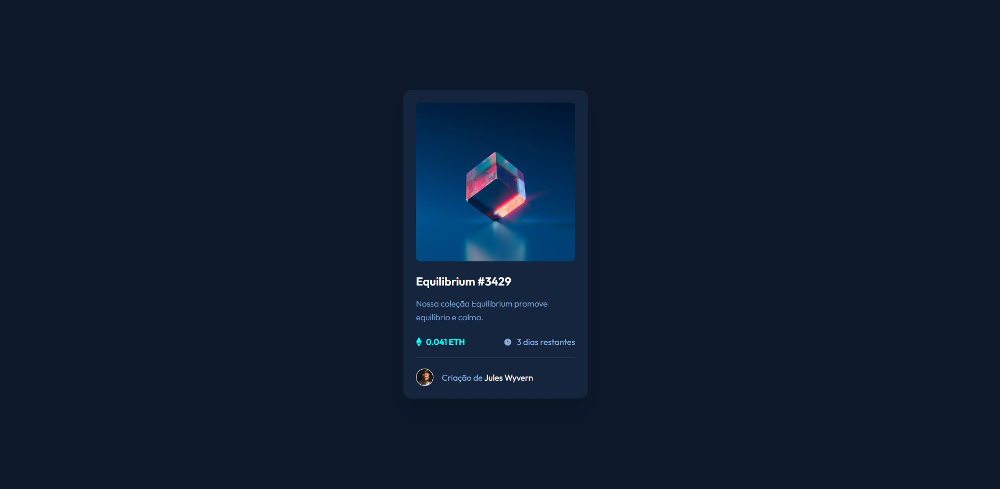

# 🎨 NFT Preview Card Component


Esta é a minha solução para o [desafio do componente de card de visualização de NFT no Frontend Mentor](https://www.frontendmentor.io/challenges/nft-preview-card-component-SbdUL_w0U). O foco foi criar um componente fiel ao design, aplicando boas práticas de arquitetura CSS.

---

## 🚀 Tecnologias e Metodologias

- **HTML5 Semântico**: Estrutura focada em acessibilidade.
- **CSS Modular**: Organização em arquivos separados (`variables.css`, `reset.css`, `style.css`).
- **Variáveis CSS**: Nomenclatura semântica para fácil manutenção.
- **Pseudo-elementos (`::before`)**: Inserção de ícones decorativos via CSS para um HTML mais limpo.
- **Flexbox**: Alinhamento e centralização responsiva.

---

## 📸 Visualização

### Desktop Design


---

## 🧠 O que eu aprendi

Neste projeto, apliquei a técnica de separar a **intenção** do design da sua **aparência**. Como o meu professor orientou, nomes de variáveis devem descrever a função e não a cor.

> "Não usamos `--blue`, usamos `--bg-card`. Isso permite que a marca mude sem que o código perca o sentido."

---

## 🔗 Links e Contato

Aqui estão os canais onde você pode encontrar mais sobre o meu trabalho e projetos:

| Canal | Link |
| :--- | :--- |
| **🌐 Meu Site** | [clicamarketing.shop](https://clicamarketing.shop/) |
| **🐙 GitHub** | [nelsonmatheus](https://github.com/nelsonmatheus) |
| **🏆 Frontend Mentor** | [@nelsonmatheus](https://www.frontendmentor.io/profile/nelsonmatheus) |
| **📧 E-mail** | [n.matheus43@gmail.com](mailto:n.matheus43@gmail.com) |

---

## 🛠️ Como rodar o projeto

1. Clone o repositório:
   ```bash
   git clone [https://github.com/nelsonmatheus/nft-preview-card.git](https://github.com/nelsonmatheus/nft-preview-card.git)

2. Abra o arquivo index.html no seu navegador.